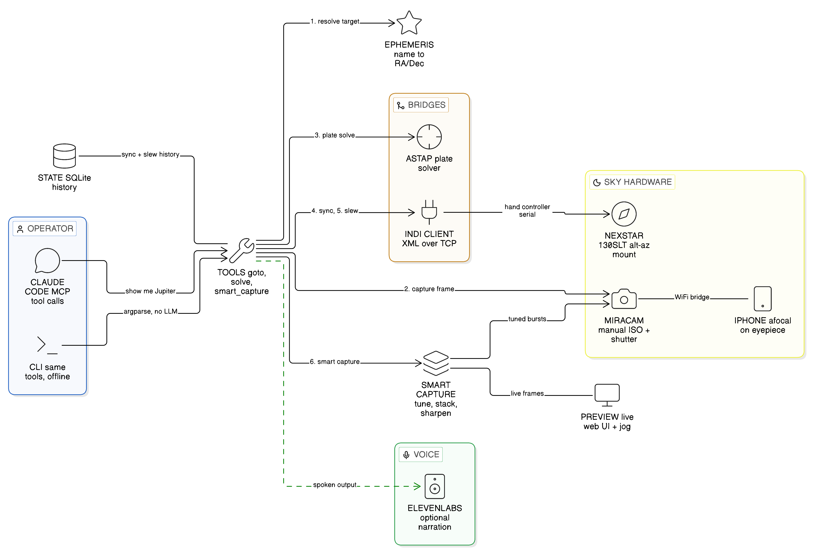

# Mira

Conversational telescope control for the Celestron NexStar 130SLT.

[](LICENSE)
[]()
[]()

## What Mira is

Mira is a system that lets you point a Celestron NexStar 130SLT at any patch of sky, say something like "Mira, show me Jupiter," and have the telescope plate-solve the current pointing, slew to the target, auto-tune the iPhone camera's ISO + shutter for that target type, and capture a final image via the right pipeline (lucky imaging for planets, live stacking for deep-sky, stretch + sharpen for the Moon). No traditional star alignment is required. The bad alignment you do at startup gets overwritten the moment your first image solves.

Mira is named for the Spanish word "look" and the variable star Mira in Cetus. The bilingual name fits the household it was built in.

The core idea: an iPhone afocally mounted over the eyepiece is wide-enough field that ASTAP can plate-solve the captured frame, the mount syncs to the solved coordinates and slews anywhere we want, and a companion iOS app (`MiraCam`, in a separate repo at https://github.com/andrewaws26/miracam-mobile) exposes the iPhone's manual ISO + shutter over WiFi so Mira can drive long-exposure astrophotography that Continuity Camera blocks.

The system runs entirely on the Mac and your local network. There is no cloud component. There is no LLM in the data path. Claude Code talks to a local MCP server that calls Python tool functions on the same machine.

## Hardware

- MacBook Air (Apple Silicon, macOS 14 or newer).
- Celestron NexStar 130SLT telescope on the standard SLT alt-az mount.
- Celestron NexStar+ hand controller.
- FTDI USB-to-RJ12 serial cable to connect the hand controller to the Mac. Off-the-shelf USB-to-RJ12 cables work; the genuine Celestron PC cable also works.
- iPhone 16 Plus (or any modern iPhone). Used either as a Continuity Camera (auto-exposure only) or via the MiraCam companion app over WiFi (true manual ISO + shutter).
- Celestron NexYZ DX adapter to mount the iPhone afocally over the eyepiece.
- 25mm Plossl eyepiece. Approximately 30 arcminutes true field with the 130SLT.

Other Celestron NexStar mounts that present the same hand-controller serial protocol should work; the INDI driver name in the config is the only piece that may need adjustment.

### Two camera modes

Mira supports two camera backends, selected in `config.yaml`:

- **`imagesnap` (Continuity Camera):** zero-setup, but Apple locks the iPhone to auto-exposure when it presents as a webcam. Fine for plate solving and bright targets, useless for nebulae or long exposures.
- **`iphone_bridge` (MiraCam app):** the iPhone runs a small Expo/React-Native app that talks to AVCaptureDevice directly with full manual control, then exposes HTTP endpoints over WiFi. Mira drives ISO, shutter (down to 1s exposures on iPhone 16), and lens position programmatically. Required for the smart-capture pipeline (auto-tune + lucky imaging + live stacking).

MiraCam lives in its own repo at https://github.com/andrewaws26/miracam-mobile and is a hard prerequisite for `source: iphone_bridge`. Sideload via Xcode once, then Mira drives it from then on.

## Software prerequisites

- macOS 14 (Sonoma) or newer.
- Python 3.11 or newer.
- Homebrew. https://brew.sh
- INDI (libindi + Celestron NexStar driver). On macOS this comes via Homebrew.
- ASTAP for plate solving. https://www.hnsky.org/astap.htm
- ASTAP star database (H17 or H18). One-time download, several gigabytes.
- imagesnap for camera capture (only if you use the `imagesnap` backend). https://github.com/rharder/imagesnap
- ffmpeg (provides ffplay) for the `mira preview` live window. https://ffmpeg.org
- Python: `Pillow`, `opencv-python-headless`, and `zeroconf` (pulled by `pip install -e .`). Used by the smart-capture pipeline and Bonjour discovery of MiraCam.
- ElevenLabs API key (optional) for spoken output. https://elevenlabs.io. Free tier (10k chars/mo) is enough for several observing sessions.
- For the iPhone bridge backend: MiraCam iOS app (separate repo, https://github.com/andrewaws26/miracam-mobile). Requires Xcode 16+ and a free Apple Developer account for sideloading.

## Installation

These steps are ordered. Run the verification command after each step before moving on.

### 1. Clone the repo

```bash
git clone https://github.com/andrewaws26/mira.git
cd mira
```

Verify:

```bash
ls README.md pyproject.toml src/mira
```

### 2. Install imagesnap (Homebrew)

```bash
brew install imagesnap ffmpeg
```

imagesnap and ffmpeg are the only Mira-related tools in Homebrew core. ASTAP and INDI need direct downloads or a source build, see steps 2a and 2b. ffmpeg is required for `mira preview`; the rest of Mira works without it.

Verify:

```bash
imagesnap -l
```

This lists video devices. If the iPhone is paired and Continuity Camera is enabled, you will see "iPhone" in the list.

### 2a. Install ASTAP

ASTAP is not in Homebrew. Download the macOS installer from SourceForge and run it:

```bash
curl -L -o /tmp/astap.pkg "https://sourceforge.net/projects/astap-program/files/macOS%20installer/astap.pkg/download"
sudo installer -pkg /tmp/astap.pkg -target /
```

The installer puts ASTAP at `/Applications/ASTAP.app`, which exposes the CLI at `/Applications/ASTAP.app/Contents/MacOS/astap`. The default `~/mira/config.yaml` already points at that path.

Verify:

```bash
/Applications/ASTAP.app/Contents/MacOS/astap -h | head -5
```

### 2b. Install INDI (build from source)

INDI is not in Homebrew core and the upstream repo does not publish macOS binaries, so we build from source. This takes about 20 minutes on Apple Silicon.

```bash
brew install cmake libnova zlib gphoto2 libusb cfitsio fftw curl theora libev pkg-config gsl
git clone --depth 1 https://github.com/indilib/indi.git ~/src/indi
mkdir -p ~/src/indi/build && cd ~/src/indi/build
cmake -DCMAKE_INSTALL_PREFIX=/opt/homebrew \
      -DINDI_BUILD_SERVER=ON \
      -DINDI_BUILD_DRIVERS=ON \
      -DCMAKE_INSTALL_RPATH=/opt/homebrew/lib \
      -DCMAKE_BUILD_WITH_INSTALL_RPATH=ON \
      ..
make -j$(sysctl -n hw.ncpu)
sudo make install
```

INDI's Celestron NexStar driver lives at `/opt/homebrew/bin/indi_celestron_gps` after install.

Verify:

```bash
indiserver -h
which indi_celestron_gps
```

If you forgot the `CMAKE_INSTALL_RPATH` flags above and the driver fails to start with `Library not loaded: @rpath/libindidriver.2.dylib`, patch the installed binaries in place:

```bash
for bin in /opt/homebrew/bin/indi_* /opt/homebrew/bin/indiserver; do
  install_name_tool -add_rpath /opt/homebrew/lib "$bin" 2>/dev/null
done
```

If you would rather not build INDI yourself, the alternative is INDIGO Server (https://www.indigo-astronomy.org). INDIGO ships a macOS .pkg but uses a different wire protocol; Mira's `mount.py` would need to swap from INDI XML to INDIGO. Stick with INDI for now.

### 3. Download the ASTAP star database

ASTAP's solver needs a star catalog on disk. Recent ASTAP uses `d05`, `d20`, `d50`, and `d80` databases (covering progressively dimmer stars). For the iPhone afocal pipeline at ~0.5 degree FOV, `d20` (434 MB compressed) is the right balance. `d50` (936 MB) is overkill but fine if you have the disk. `d05` (137 MB) is too sparse for reliable solves at this FOV.

```bash
curl -L -o /tmp/d20.pkg "https://sourceforge.net/projects/astap-program/files/star_databases/d20_star_database.pkg/download"
sudo installer -pkg /tmp/d20.pkg -target /
```

The default `~/mira/config.yaml` is set to `star_db: d50`. If you installed `d20` instead, change `solver.star_db` to `d20`.

Verify by listing the ASTAP application support directory:

```bash
ls ~/Library/Application\ Support/astap/ 2>/dev/null
ls /Applications/ASTAP.app/Contents/MacOS 2>/dev/null
```

### 4. Set up a Python virtual environment

```bash
python3 -m venv .venv
source .venv/bin/activate
pip install --upgrade pip
```

Verify:

```bash
python --version
```

This must report Python 3.11 or newer.

### 5. Install Mira

```bash
pip install -e ".[mcp,dev]"
```

The `mcp` extra installs the MCP SDK; the `dev` extra installs pytest and ruff.

Verify:

```bash
mira --version
mira --help
python -m pytest tests/
```

The unit suite should report 125 passing tests.

### 6. Configure Continuity Camera

On the Mac, open System Settings, then General, then AirPlay & Continuity. Make sure "Continuity Camera" is on. On the iPhone, open Settings, then General, then AirPlay & Continuity, and confirm the same.

Bring the iPhone within Bluetooth range of the Mac. Unlock it. Run `imagesnap -l` again. The iPhone must appear by name in the device list.

### 7. Find your serial port

Plug the FTDI cable into a USB port on the Mac and into the bottom of the NexStar+ hand controller. Power on the mount.

```bash
ls /dev/tty.usbserial-*
```

Note the exact path. The suffix is unique per cable.

### 8. Create your config

```bash
mkdir -p ~/mira
cp config.example.yaml ~/mira/config.yaml
$EDITOR ~/mira/config.yaml
```

If you want spoken output, also drop your ElevenLabs API key into `~/mira/.env`:

```bash
echo "ELEVENLABS_API_KEY=sk_your_key_here" > ~/mira/.env
chmod 600 ~/mira/.env
```

`~/mira/.env` is gitignored. Then in `~/mira/config.yaml` set `speech.enabled: true`.

Edit at minimum:

- `observer.latitude` and `observer.longitude` for your location
- `mount.port` to the path you found in step 7. **Use the `cu.` form, not `tty.`**, on macOS. The Celestron INDI driver auto-saves `cu.usbserial-XXX` and overriding with the `tty.` variant changes the open semantics in a way the driver cannot handle (CONNECT will succeed but the mount handshake will silently fail).
- `solver.astap_path` if ASTAP is not at `/usr/local/bin/astap`. On Apple Silicon Homebrew it is usually at `/Applications/ASTAP.app/Contents/MacOS/astap`.
- `camera.source` to either `imagesnap` (legacy auto-exposure) or `iphone_bridge` (manual control via MiraCam). If you pick `iphone_bridge`, set `camera.iphone_url` to your iPhone's URL (e.g. `http://192.168.1.55:8080`) or leave it null to discover via Bonjour.

For the smart-capture pipeline (`source: iphone_bridge`), follow the MiraCam setup at https://github.com/andrewaws26/miracam-mobile before this step. You need MiraCam running on the iPhone before Mira's iPhone bridge will work.

Verify the config loads:

```bash
mira --config ~/mira/config.yaml status
```

This will show observer info and a "mount: NOT connected" line. That is correct; the mount becomes reachable only after step 9.

### 9. Start the INDI server

In a dedicated terminal window, start the INDI server with the Celestron driver:

```bash
indiserver -v indi_celestron_gps
```

Leave this running for the entire observing session. Open a second terminal for everything else.

Verify in the second terminal:

```bash
nc -z localhost 7624 && echo "INDI reachable"
```

## First-time setup

### Pair the iPhone

Done in step 6 above. Tested with `imagesnap -l`.

### Configure INDI

The INDI driver is `indi_celestron_gps`. Despite the name, this driver covers all current Celestron NexStar mounts including the non-GPS 130SLT. The mount appears on the INDI bus as device "Celestron GPS". Mira's `mount.py` defaults to that device name. If your INDI build uses a different driver name, run `indiserver -v <other_driver>` and adjust accordingly. The protocol is identical.

### Find the right serial port

Done in step 7. If multiple USB-serial devices are connected, the suffix tells you which is which: unplug the FTDI cable, run `ls /dev/tty.usbserial-*`, plug it back in, and run again. The new entry is the one you want.

## Verification workflow

After installation, run the full prerequisite check:

```bash
python scripts/verify_setup.py
```

You should see PASS lines for Python, macOS, imagesnap, ASTAP, the star database, your config file, the state database, and the INDI server. Any FAIL line includes a Fix line that tells you what to do.

Then run the smoke tests, in order, before your first observing session:

```bash
# 1. Camera. Captures a still frame from the iPhone.
python scripts/test_camera.py

# 2. Mount connection. No movement.
python scripts/test_mount_connect.py

# 3. ASTAP solve. Pass any starfield image you have, or use the fixture.
python scripts/test_solver.py path/to/starfield.jpg

# 4. Mount slew. MOVES THE TELESCOPE 1 degree, then back.
python scripts/test_mount_slew.py

# 5. Full pipeline. MOVES THE TELESCOPE. Capture, solve, sync, slew, verify.
python scripts/test_full_loop.py
```

Steps 4 and 5 prompt for confirmation before moving the OTA. Make sure the tube is clear of obstructions before answering "yes".

## Pre-session checklist

Two commands once everything is wired up. Step 1 is hardware (your hands). Step 2 is software (Mira does the rest).

1. **Hardware**:
   1. Connect the FTDI cable to the hand controller and the Mac.
   2. Power on the mount.
   3. On the hand controller: press Enter at "Press ENTER to begin alignment", confirm the time/location prompts, pick **Solar System Align**, point at anything bright, press Enter to "align". The mount considers itself aligned. (Mira's first plate-solve sync will overwrite this with the real pointing.)
   4. (Optional) Mount the iPhone afocally over the eyepiece via the NexYZ DX. To center it, run `mira preview` in any terminal while you turn the knobs.

2. **Software**:
   ```bash
   cd /Users/andrewsieg/mira
   source .venv/bin/activate
   mira up
   ```
   That starts indiserver, connects to the mount, and reports current pointing. If the mount fails to connect, the error tells you what to do (usually "you skipped the alignment menus on the hand controller").

After `mira up` you're observing. Drive it any of these ways:
- `mira jog` for keyboard nudging
- Talk to Claude Code: "Mira, point at Saturn"
- Direct CLI: `mira goto Jupiter`, `mira where`, `mira status`

When done:
```bash
mira down
```
Then power off the mount via the hand controller.

## Usage

### CLI

The two lifecycle commands you'll use most:

```bash
mira up        # start indiserver, connect to mount, report status
mira down      # disconnect and stop indiserver
```

Per-task commands:

```bash
# Resolve a target name without moving the mount.
mira resolve Jupiter

# Capture a frame and save it.
mira capture --output /tmp/test.jpg

# Smart-capture WITHOUT slewing: tune exposure for the target type and
# run the right pipeline (lucky imaging for planets, live stack for
# deep-sky, stretch+sharpen for moon, single tuned frame for stars).
# Requires source: iphone_bridge in config.yaml.
mira capture --target Jupiter            # lucky imaging burst
mira capture --target M42                # live stack
mira capture --target Moon               # moon processing
mira capture --target M42 --pipeline lucky --n-frames 60  # overrides

# Solve a saved image.
mira solve /tmp/test.jpg

# Read the mount's current position.
mira where

# Live preview window of the iPhone feed (ffplay, AVFoundation -- for
# centering during alignment).
mira preview

# Live web UI: latest captured frame + in-progress stack + camera state
# + iPhone live feed. Opens at http://<mac-ip>:8090. Same URL works on
# the Mac and on the iPhone via Safari.
mira watch

# Same, plus arrow-key mount control over the LAN. Number keys 1-9 set
# slew rate. Hold to move, release to stop. Q stops all motion.
mira watch --jog

# Speak text out loud through the configured TTS voice.
mira say "Saturn is up tonight"

# List available ElevenLabs voices.
mira voices

# Generate a sound effect and save it.
mira sfx "a single deep conch shell call across open ocean at dusk" --duration 6

# Compose a narrated audio piece (voice + matched music + optional bookend SFX).
# Auto-tunes voice settings from the script's audio tags. Saves to
# ~/mira/captures/narrations/.
mira compose path/to/story.txt \
  --music "cinematic Polynesian voyaging anthem with pahu drums..." \
  --intro-sfx "deep conch shell call with reverb tail" \
  --outro-sfx "soft ocean waves and distant insect chorus"

# Capture, solve, and sync (no slew).
mira sync

# The headline operation: capture, solve, sync, slew to a named target,
# then run the target-aware smart capture pipeline.
mira goto Jupiter                   # slew + lucky-imaging burst
mira goto M31                       # slew + live stack
mira goto Vega                      # slew + single tuned frame
mira goto "Orion Nebula"            # alias resolves to M42 -> live stack
mira goto Saturn --no-capture       # slew only, skip the smart capture
mira goto Moon --out ~/Pictures/moon-tonight.jpg

# Show mount status, last sync, last slew.
mira status

# Keyboard control of the mount: arrows nudge, +/- step size,
# 1-9 slew rate, space aborts, q quits.
mira jog

# Push observer location and current UTC to the mount (one shot).
# Note: the mount's hand controller rejects this once it has been aligned.
mira gps-push
```

Run `mira <command> --help` for per-subcommand options.

### Claude Code via MCP

Register Mira as an MCP server in your Claude Code settings. Open Claude Code's settings file (typically `~/.claude/settings.json` or per-project `.claude/mcp.json`) and add:

```json
{
  "mcpServers": {
    "mira": {
      "command": "/path/to/mira/.venv/bin/mira-mcp"
    }
  }
}
```

Restart Claude Code. You can now ask things like:

- "Mira, where is the telescope pointed right now?"
- "Mira, show me Jupiter." → goto with the lucky-imaging pipeline auto-selected
- "Mira, what kind of target is M51 and how would you capture it?" → calls `classify_target("M51")` and explains the routing before acting
- "Mira, point at M31 then move 30 arcminutes east."
- "Mira, recapture without slewing." → `smart_capture(last_target)` re-runs the pipeline on the current pointing
- "Mira, compose a 90 second piece about the Pleiades with a soft acoustic bed, conch intro, ocean outro."

Claude picks the right tool from the descriptions Mira ships in the MCP schema. The smart-capture pipeline is the default behavior of `goto`, so "show me X" is enough to trigger the full slew + tune + lucky-image / live-stack / moon-process flow.

## Architecture



The goto loop needs no star alignment: resolve the name, capture a frame, plate-solve it, sync the mount to the solved coordinates, slew, then run the target-aware smart-capture pipeline. Everything runs on the Mac and local network; the only cloud call is optional ElevenLabs narration.

Three layers:

1. **Tool functions** (`mira/tools.py`): standalone Python functions that do the actual work. The main set: `get_target_coordinates`, `capture_frame`, `plate_solve`, `sync_mount`, `slew_to`, `get_mount_position`, `wait_for_slew_complete`, `get_observer_location`, `goto`, `smart_capture`, `classify_target`, `orient`. Every one has type hints and docstrings, and is unit-tested with mocked hardware.

2. **CLI** (`mira/cli.py`): an argparse wrapper around the tool layer. Subcommands include `goto`, `sync`, `where`, `capture` (with `--target` for smart-capture without slewing), `solve`, `status`, `devices`, `resolve`, `preview`, `watch` (web UI + optional jog), `jog`. Designed to work without an LLM, including offline.

3. **MCP server** (`mira/mcp_server.py`): exposes the same tool functions over the Model Context Protocol so Claude Code can call them. Uses the official MCP Python SDK with FastMCP. Each tool's docstring becomes the MCP description; type hints become the JSON schema.

Underneath, the smart-capture pipeline modules sit between the tool layer and the hardware:

- `camera.py` / `iphone_camera.py` -- two camera backends, selected by `config.yaml`. `iphone_camera.py` is an HTTP client for the MiraCam iOS app (separate repo).
- `imaging.py` -- pure-function image primitives (luminance, star count, sharpness).
- `exposure_tuning.py` -- per-target preset table + closed-loop ISO/shutter tuner.
- `stacking.py` -- lucky imaging (burst + rank + ECC align + mean stack) and live stacking (timed capture + phase-correlation align + sum + normalize).
- `moon_processing.py` -- single-frame stretch + unsharp mask + gamma on the luminance channel.
- `target_type.py` -- name -> category classifier (moon / planet / cluster / nebula / galaxy / star / default).
- `pipeline_state.py` -- file-based IPC for the live preview (`~/mira/captures/current/`).
- `preview_server.py` -- stdlib HTTP server that renders the live preview web page; optional `--jog` mode adds mount control endpoints.

Hardware modules stay isolated: `mount.py` (INDI XML over TCP), `camera.py` (imagesnap subprocess), `solver.py` (ASTAP subprocess). Each can be mocked for tests.

Supporting modules:

- `config.py`: typed YAML loader for `~/mira/config.yaml`.
- `state.py`: SQLite database tracking sync history, slew history, and sessions.
- `ephemeris.py`: Skyfield wrapper that resolves names (planets, M1 to M110, named stars, common DSO aliases) to apparent RA/Dec at the configured observer location.
- `mount.py`: pure-Python INDI XML wire-protocol client. Reader thread parses incoming property updates; main thread sends commands. Avoids the C extension build pain of pyindi-client on Apple Silicon. Wraps INDI's Celestron driver, which is the supported way to talk to NexStar mounts.
- `camera.py`: imagesnap subprocess wrapper. Continuity Camera shows up as a standard AVFoundation device.
- `solver.py`: ASTAP subprocess wrapper. Parses both .wcs (FITS-card) and .ini ASTAP outputs.

Coordinate convention everywhere in the public API: RA in degrees [0, 360), Dec in degrees [-90, 90], "apparent of date" position from the topocentric observer (precession, nutation, and aberration accounted for). The mount expects of-date coordinates; using J2000 catalog values directly produces a consistent pointing offset that looks like a calibration bug but is actually a math bug.

## Troubleshooting

### Continuity Camera not appearing

Run `imagesnap -l`. If the iPhone is not in the list:

- Unlock the iPhone.
- Bring it within ~30 ft of the Mac.
- Confirm both devices are signed into the same Apple ID.
- Confirm Continuity Camera is enabled in System Settings on both devices.
- Toggle Bluetooth off and on.
- If it still does not appear, restart the iPhone. Continuity Camera initialization can wedge.

### Serial port permission issues

```
PermissionError: [Errno 13] Permission denied: '/dev/tty.usbserial-AB0K3LX2'
```

This is rare on macOS but can happen if some other process has the port open. List processes holding the port:

```bash
lsof /dev/tty.usbserial-AB0K3LX2
```

Kill the offender, or close the application that holds it.

### ASTAP solve failures

ASTAP failing with "too few stars" or "no solution" is usually one of:

- FOV mismatch. Tune `solver.estimated_fov_deg` in config. The iPhone over a 25mm Plossl in the 130SLT is roughly 0.5 degrees, but afocal alignment shifts this. Try 0.3 to 0.8 degrees.
- Image too dim. Run `mira capture` and inspect the JPEG. If you see fewer than ~15 stars, increase the iPhone exposure (manual mode in the camera app, or use Halide / Adobe Lightroom for finer control).
- Star database too coarse. H17 covers down to magnitude 17; H18 to magnitude 18. Use H18 if the field is sparse.
- Wrong RA/Dec hint. If you pass `--ra` / `--dec` hints far from the actual pointing, ASTAP gives up. Try without hints first.

### Mount not accepting sync commands

The 130SLT firmware refuses sync, slew, or goto until it believes it has been aligned. If the first command after powering on fails with an Alert state, do the fake alignment via the hand controller (any align mode pointed at anything) and retry. Mira will overwrite the bad alignment with a real one on the first sync.

### "INDI server not running"

Start it explicitly in a terminal:

```bash
indiserver -v indi_celestron_gps
```

If you get "command not found", finish step 2b (build INDI from source). The Celestron NexStar driver is part of `INDI_BUILD_DRIVERS=ON` in that build.

### Plate solves succeed but slew lands far from the target

This is almost always a coordinate-frame bug. Mira computes apparent of-date coordinates and sends them to INDI's `EQUATORIAL_EOD_COORD` property, which is the right pairing. If you have modified the code to use J2000 coordinates instead, you will see a consistent ~0.5 degree offset for all targets that grows over decades.

### MCP server starts but Claude Code does not see Mira's tools

- Confirm the `command` path in the Claude Code MCP config points at the venv's `mira-mcp` binary, not a system Python.
- Restart Claude Code completely after editing the MCP config.
- Run `mira-mcp` manually and observe stderr for any Python tracebacks at startup.

## The fake alignment quirk

Celestron's NexStar firmware has a hard interlock: the mount refuses Goto, Sync, and slew commands until it thinks it has been aligned. This is by design; an unaligned alt-az mount has no idea where it is or what direction is up.

For Mira's workflow, the alignment is not actually needed. The first plate solve plus sync gives the mount a perfect alignment. But the firmware does not know that yet, so we have to lie to it.

The fake alignment ritual:

1. Power on the mount.
2. Use the hand controller to start "Solar System Align" or "One Star Align".
3. When the controller asks you to center an alignment object, point at anything bright. Press Enter to "confirm".
4. The hand controller now flips its internal "aligned" flag. Goto commands will work.

The pointing accuracy from this alignment is intentionally bad; it does not matter. Mira's first sync will overwrite the alignment with the plate-solved truth.

## License

MIT. See [LICENSE](LICENSE).
